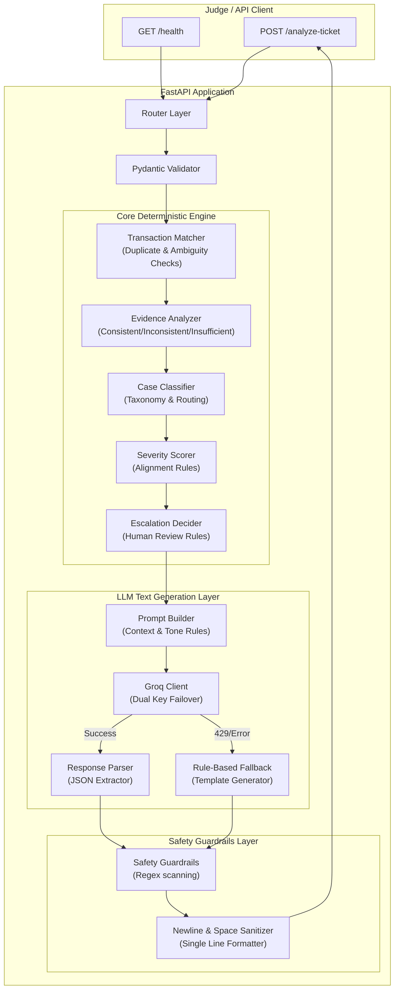

# QueueStorm Investigator — AI Copilot for Digital Finance Support

QueueStorm Investigator is a high-performance, robust, and secure AI/API copilot designed for digital financial services platforms (similar to bKash). It automates the analysis of customer support tickets by cross-referencing user complaints with recent transaction history, classifying issues, routing them to the correct department, and generating safe, professional customer replies in the matching language (English or Bangla).

---

## Table of Contents
1. [Live Deployment](#1-live-deployment) — [fable-flash-preli.vercel.app](https://fable-flash-preli.vercel.app/)
2. [System Architecture](#2-system-architecture)
3. [Technology Stack](#3-technology-stack)
4. [Setup and Run Instructions](#4-setup-and-run-instructions)
5. [Run with Docker](#5-run-with-docker)
6. [API Documentation](#6-api-documentation)
7. [AI and Model Usage](#7-ai-and-model-usage)
8. [Safety Logic and Guardrails](#8-safety-logic-and-guardrails)
9. [Known Limitations](#9-known-limitations)
10. [Verification and Tests](#10-verification-and-tests)

---

## 1. Live Deployment

The service is deployed live and is reachable at:
👉 **URL**: [https://fable-flash-preli.vercel.app/](https://fable-flash-preli.vercel.app/)

The standard endpoints exposed on the deployment are:
* **Health Check**: `GET /health`
* **Analyze Ticket**: `POST /analyze-ticket`

---

## 2. System Architecture

QueueStorm Investigator uses a **Hybrid Rule-Based + LLM Architecture**. The core reasoning (transaction matching, classification, routing, severity scoring, and escalation) is handled deterministically via rule-based python engines. The LLM (via Groq) is used strictly for high-quality language understanding and text generation (summaries and customer replies). Finally, a programmatic post-processing safety guardrail acts as the final line of defense.



### Components Breakdown:
* **Transaction Matcher**: Finds the relevant transaction from history based on amount, transaction type, counterparty mentions, status, and time hints. It incorporates duplicate transaction detection (same amount and counterparty within 120s) and established recipient patterns (3+ past transfers to the same recipient).
* **Case Classifier**: Classifies tickets into 8 case types and routes them to 6 specific departments using keyword and pattern matching.
* **Severity Scorer**: Scores severity (`low`, `medium`, `high`, `critical`) strictly according to platform rules.
* **Escalation Decider**: Determines `human_review_required`. Correctly skips human review for tickets that need customer clarification (`insufficient_data` verdict) to keep the support agent's queue clear of vague/ambiguous tickets.
* **Groq API Client**: Communicates with the LLM. Supports automatic dynamic key failover across any number of keys matching `GROQ_API_KEY_*` (e.g. key 1, key 2, key 3, etc.) sequentially upon hitting HTTP 429 rate limits, and falls back to a template-based generator if all keys fail.
* **Safety Guardrails**: Scans generated outputs for credit card/PIN/OTP requests, unauthorized refund/reversal promises, and third-party references. It strips all newline characters (`\n`, `\r`) from text fields to guarantee flat, single-line strings.

---

## 3. Technology Stack

* **Core Framework**: Python 3.10+, FastAPI (Asynchronous web framework)
* **Web Server**: Uvicorn (ASGI server)
* **Validation**: Pydantic v2 (Strict request/response parsing)
* **HTTP Client**: HTTPX (Async HTTP requests for Groq API with timeout and failover handling)
* **Testing**: Pytest & Pytest-Asyncio
* **Configuration**: Python-dotenv (Env variables loading)

---

## 4. Setup and Run Instructions

### Prerequisites
* Python 3.10 or higher installed on your system.
* Groq API Key(s).

### Installation
1. **Clone the repository** and navigate to the project root:
   ```bash
   cd FableFlash-Preli
   ```

2. **Create a virtual environment**:
   ```bash
   python -m venv venv
   ```

3. **Activate the virtual environment**:
   * **Windows (PowerShell)**:
     ```powershell
     .\venv\Scripts\Activate.ps1
     ```
   * **Linux/macOS**:
     ```bash
     source venv/bin/activate
     ```

4. **Install dependencies**:
   ```bash
   pip install -r requirements.txt
   ```

### Configuration
1. Create a `.env` file at the project root (you can copy the provided `.env.example` template):
   ```env
   GROQ_API_KEY_1=your_first_groq_key_here
   GROQ_API_KEY_2=your_second_groq_key_here
   GROQ_MODEL=openai/gpt-oss-120b
   PORT=8000
   ```
2. Replace `your_first_groq_key_here` and `your_second_groq_key_here` with your actual Groq API keys. You can add more keys as well (`GROQ_API_KEY_3`, `GROQ_API_KEY_4`, etc.) which will be automatically detected and used in order. (If no keys are configured, the application automatically uses the deterministic fallback template generator for text fields).

### Running the Application
Run the ASGI server using Uvicorn:
```bash
python -m uvicorn app.main:app --host 0.0.0.0 --port 8000 --reload
```

---

## 5. Run with Docker

You can run the application as a lightweight Docker container by either pulling the pre-built image from Docker Hub or building it locally.

### Option A: Pull from Docker Hub (Recommended)
1. **Pull the image**:
   ```bash
   docker pull sifatul67/queuestorm-investigator:latest
   ```

2. **Run the container** (passing your `.env` file for configuration):
   ```bash
   docker run -p 8000:8000 --env-file .env sifatul67/queuestorm-investigator:latest
   ```

### Option B: Build and Run Locally
1. **Build the Docker Image**:
   ```bash
   docker build -t queuestorm-investigator .
   ```

2. **Run the Container**:
   ```bash
   docker run -p 8000:8000 --env-file .env queuestorm-investigator
   ```

---

## 6. API Documentation

### 1. Health Endpoint
* **Route**: `GET /health`
* **Response**:
  ```json
  {
    "status": "ok"
  }
  ```

### 2. Analyze Ticket Endpoint
* **Route**: `POST /analyze-ticket`
* **Request Header**: `Content-Type: application/json`
* **Request Shape**: Refer to the sample below.
* **Response Shape**: Refer to the sample below.

---

## 7. AI and Model Usage

* **Primary Model**: `openai/gpt-oss-120b` (or Groq's available models)
* **Location**: Deployed via Groq's high-speed cloud inference engine.
* **Why Chosen**: Groq provides ultra-low latency inference, enabling responses well within the required 30-second window (typically under 2 seconds per ticket). The hybrid model offloads all heavy-lifting decision logic to local rules, utilizing the LLM only for summarizing, translation, and tone adaptation.
* **Cost Reasoning**: Offloading matching and classification to local Python rules means we use less complex prompts with smaller token footprints (saving input tokens). The temperature is set to `0.1` to maintain high determinism while producing natural and localized replies.

---

## 8. Safety Logic and Guardrails

Fintech safety is a hard requirement. The following rules are enforced programmatically in the safety guardrails layer, bypassing/sanitizing LLM outputs if needed:

1. **Credential Prevention**:
   * Scans generated customer replies for requests of credentials (PIN, OTP, passwords, card numbers) using negative-lookahead regular expressions.
   * If any match is found, the offending sentence is replaced with: *"Please do not share your PIN or OTP with anyone."* (or the Bengali equivalent).
2. **Refund and Reversal Promises**:
   * Outright promises of financial actions (e.g., *"we will refund you"*, *"refund has been completed"*, *"your account will be unblocked"*) are programmatically blocked.
   * They are replaced with deferred, official-channel phrasing: *"any eligible amount will be returned through official channels"*.
3. **Official Referrals Only**:
   * Scans for external links or phone numbers that do not belong to official communication channels and replaces them with official contact instructions.
4. **Credential Warning Enforcement**:
   * Every customer reply is validated to ensure it contains a PIN/OTP warning reminder. If absent, the warning is automatically appended in the correct language.
5. **No Newlines Guarantee**:
   * Replaces all newlines (`\n`, `\r`) and literal newline strings (`\n`, `\r`) with spaces, ensuring clean integrations.

---

## 9. Known Limitations

1. **Mixed-Language Complexity**: Extremely complex Bengali-English code-switching (Banglish) might result in minor grammatical errors in the LLM-generated summaries, though safety rules and keywords remain intact.
2. **Context-Free Tickets**: If both transaction history is empty and the complaint text contains no identifiers or descriptions (e.g., *"Check my money"*), the system falls back to `insufficient_data` and asks for clarification, which is expected behavior.
3. **LLM Connection Failures**: If Groq cloud endpoints suffer outages or both keys exhaust their quotas, the system relies entirely on local templates, which are grammatically correct and safe but generic.

---

## 10. Verification and Tests

A complete suite of 29 automated test cases validates functionality, covering health checks, input validation errors, prompt injection vulnerabilities, and all 10 problem statement sample cases.

To run the test suite:
```bash
pytest
```
